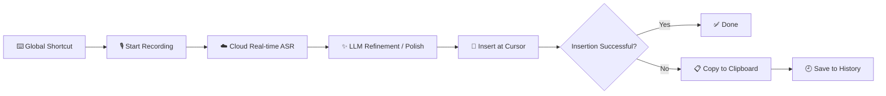
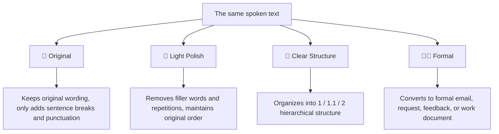
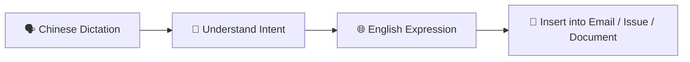
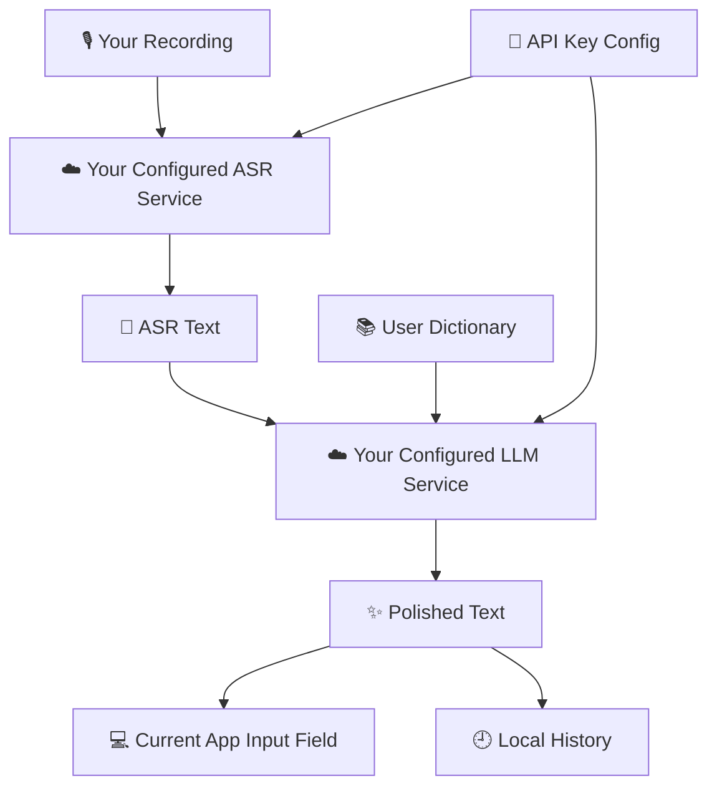
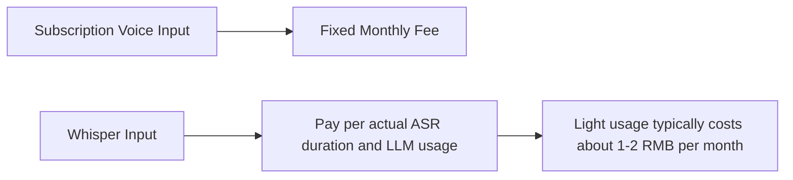

<div align="center">

**English** | [中文](README_zh.md)

</div>

<p align="center">
  
</p>

<h1 align="center">Whisper Input / 轻语输入</h1>

<p align="center">
  An AI voice input tool for Windows professionals: turns spoken words into polished, structured text ready to send, report, or hand off.
</p>

<p align="center">
  <a href="https://github.com/EthanYoQ/whisper-input/releases"></a>
  <a href="https://github.com/EthanYoQ/whisper-input/blob/main/LICENSE"></a>
  <a href="https://github.com/EthanYoQ/whisper-input/stargazers"></a>
</p>

---

## 🎯 At a Glance

Whisper Input is not a traditional IME, nor a meeting transcription tool.

It does one thing: **press a shortcut key, speak, and it turns your spoken words into natural, well-structured text at your cursor position.**

Here are some typical scenarios:

| Scenario | What you say | What Whisper Input produces |
| --- | --- | --- |
| 💬 Everyday chat | "Just handle this requirement like this for now, I will fill in the details tomorrow" | Clear, natural chat text with fewer filler words |
| 🧑‍💼 Reporting to your boss | "Boss, there are three meetings this week, which one works for you?" | A formal request / meeting invitation |
| 🧱 Task breakdown | "First push the code, second update the README, third publish the installer" | `1.`, `1.1`, `2.` structured text |
| 🌐 English output | Dictate email content in Chinese | English email / Issue / work document |
| 🔢 Number formatting | "Three yuan twenty-eight, tomorrow at two in the afternoon" | `3.28 yuan`, `Tomorrow 14:00` |

---

## 🧭 How It Works



No need to switch input methods, open a chat window, or copy and paste manually.  
Wherever your cursor is, the transcribed text appears there; if insertion fails, it is automatically copied to the clipboard as a fallback.

---

## ✨ Core Capabilities

| Icon | Capability | Problem It Solves |
| --- | --- | --- |
| 🎙️ | Chinese voice input | Designed for real work scenarios—primarily Chinese with occasional English terms |
| ⚡ | Low-latency pipeline | Recognizes, polishes, and inserts as quickly as possible after recording ends |
| 🧹 | Light polish | Removes "uh", "um", "like", filler words, repetitions, and obvious speech errors |
| 🧱 | Clear structure | Organizes multiple points from spoken text into hierarchical numbering |
| 🧑‍💼 | Formal expression | Converts to emails, requests, feedback, handoff documents, and other formal text |
| 🌐 | Chinese to English | Speak in Chinese, get English work text as output |
| 🔢 | Format normalization | Automatically formats currency, time, numbers, and corrects spacing and punctuation |
| 📚 | User dictionary | Preserves names, company names, product names, and technical terms |
| 🕘 | History | Local review, copy, and delete recent inputs |
| 📋 | Clipboard fallback | Ensures you get the result even if insertion into the input field fails |

---

## 🧩 Four Output Styles



### Original Dictation

```text
Hey boss about that project acceptance I was wrong earlier it is not Tuesday it is Wednesday at two in the afternoon and also please check the contract and payment milestones and the testing part needs some changes too.
```

### 📝 Original

```text
Hey boss, about the project acceptance—I was wrong earlier, it is not Tuesday, it is Wednesday at two in the afternoon. Also, please check the contract and payment milestones, and the testing part needs some changes too.
```

### 🧹 Light Polish

```text
Boss, regarding the project acceptance—I was wrong earlier. It is not Tuesday, but Wednesday at two in the afternoon. Please check the contract and payment milestones. The testing part also needs some changes.
```

### 🧱 Clear Structure

```text
Boss, regarding the project acceptance, the following items need to be adjusted:

1. Time Correction
1.1 The project acceptance is not on Tuesday, but on Wednesday at 2:00 PM.

2. Items Requiring Confirmation
2.1 Please review the contract and payment milestones.
2.2 The testing section needs adjustments.
```

### 🧑‍💼 Formal

```text
Dear Boss,

Regarding the project acceptance, I would like to update you on the following:

1. Time Correction
The project acceptance date was previously stated incorrectly. It has been corrected to Wednesday at 2:00 PM.

2. Items Requiring Confirmation
Please review the contract and payment milestones. Additionally, the testing section requires further adjustments.

Thank you.
```

---

## 🧑‍💼 Formal Expression Example: Meeting Invitation

You can dictate naturally, just as you would speak:

```text
Hello Director Li, there are three meetings this week: tomorrow is the Jiangsu Provincial Annual Conference, Thursday is the Chang'an Studies Forum, and Friday is the Factory Recruitment Fair. The locations are Jinan, Tai'an, and Xinjiang respectively. Which one would be convenient for you to attend? I would like to invite you to one of the meetings. Thank you.
```

The Formal mode would produce output more like this:

```text
Dear Director Li,

I would like to request your attendance at one of this week's meetings as follows.

1. Meeting Schedule
1.1 Jiangsu Provincial Annual Conference: Tomorrow, in Jinan.
1.2 Chang'an Studies Forum: Thursday, in Tai'an.
1.3 Factory Recruitment Fair: Friday, in Xinjiang.

2. Request
We sincerely invite you to attend and provide guidance at one of these meetings. Please let us know which meeting fits your schedule this week.

Thank you.
```

It will not fabricate background information or expand on facts you did not mention. The focus is on organizing what you have already said into a format more suitable for professional communication.

---

## 🌐 Speak Chinese, Output English



You say:

```text
Help me write something in English saying we have completed this update. The main fix was for the issue where long voice input text would get truncated, and we also improved the Formal expression mode.
```

Output:

```text
We have completed this update. The main changes include fixing the issue where long voice input could be truncated, and improving the Formal style so that spoken content is converted into a more structured and professional format.
```

No need to think in English while typing, or write Chinese first and then copy it into a translation tool.

---

## 🔐 Data & Privacy

Whisper Input is a cloud-first product, not an offline ASR tool. You need to configure your own cloud ASR and LLM API keys.



| Data | Default Location / Destination |
| --- | --- |
| 🎙️ Audio Recording | Sent to your configured cloud ASR service |
| 📝 ASR Text | Sent to your configured LLM service |
| 🕘 History | Saved locally by default |
| 📚 User Dictionary | Saved locally by default |
| 🔑 API Key | Stored in local config, can be cleared |

You can clear history, dictionary, and API configuration from the settings.

---

## ⚙️ Recommended Configuration

| Type | Recommendation | Notes |
| --- | --- | --- |
| 🎙️ Default ASR | Qwen Real-time ASR | Better overall Chinese performance and lower latency after stopping speech |
| 🎙️ Backup ASR | Doubao Streaming Speech Recognition 2.0 | Can serve as a backup pipeline |
| ✨ Default LLM | Qwen / Gemini / Doubao | Choose based on region, cost, and availability |
| ⚡ Low-cost mode | Lightweight LLM | Suitable for high-frequency daily input |

The settings interface includes built-in common models and API endpoints. Regular users just need to select a service provider and enter their API key.

---

## 💰 Why It's Low Cost

Whisper Input uses your own API keys—no expensive subscriptions required.



Actual costs depend on your chosen service provider, model, audio duration, and usage volume. For light daily input, the cost is typically far lower than subscription-based tools like Typeless.

---

## 🚀 Installation & Usage

1. Open [Releases](https://github.com/EthanYoQ/whisper-input/releases).
2. Download the latest Windows installer.
3. Install and launch Whisper Input.
4. Go to "Settings - Model Settings".
5. Select the Qwen or Doubao option and enter the corresponding API key.
6. Press the global shortcut key and start speaking.

---

## 🧱 Product Boundaries

Whisper Input intentionally does NOT do the following:

| Does NOT Do | Reason |
| --- | --- |
| ❌ Register as a Windows system IME | Stays lightweight, does not take over the system IME |
| ❌ Meeting transcription tool | Focused on short-to-medium text input, not a meeting documentation platform |
| ❌ Chatbot | Does not generate information the user has not spoken |
| ❌ RAG / Agent | Maintains its position as an input tool |
| ❌ Offline ASR-first | Current focus is cloud-first, prioritizing real-world usability |

---

## 🙏 Acknowledgements: OpenLess

Whisper Input is built upon [OpenLess](https://github.com/Open-Less/openless).

Thanks to the OpenLess authors and contributors for laying the foundation in desktop voice input, global shortcuts, recording state management, text insertion, and Tauri application infrastructure. Building on this foundation, Whisper Input pivots to a Windows cloud-first approach, focusing more on Chinese professional voice input, formal expression, Chinese-to-English translation, and low-cost API usage.

---

## ⭐ Star

If you find this project helpful, please consider giving it a star on GitHub to support continued development.

## License

MIT
