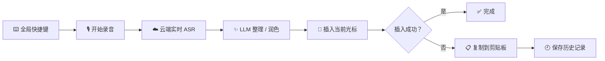
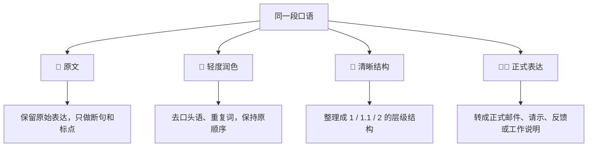
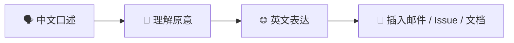
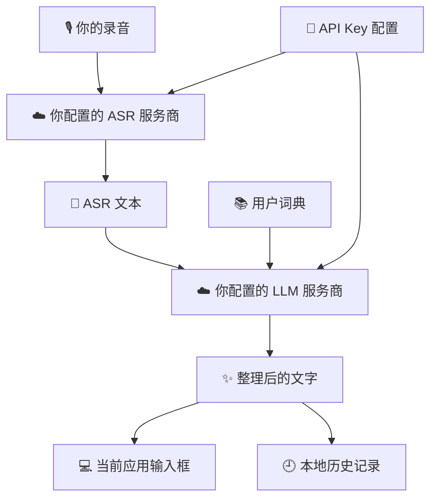
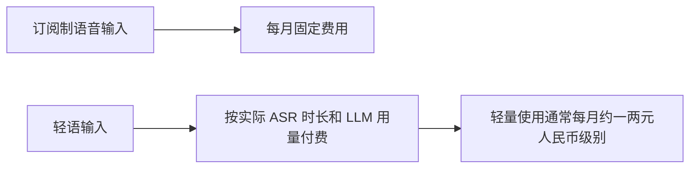

<div align="center">

[English](README.md) | **中文**

</div>

<p align="center">
  
</p>

<h1 align="center">轻语输入 / Whisper Input</h1>

<p align="center">
  面向 Windows 职场用户的 AI 语音输入工具：把口语变成可发送、可汇报、可交接的文字。
</p>

<p align="center">
  <a href="https://github.com/EthanYoQ/whisper-input/releases"></a>
  <a href="https://github.com/EthanYoQ/whisper-input/blob/main/LICENSE"></a>
  <a href="https://github.com/EthanYoQ/whisper-input/stargazers"></a>
</p>

---

## 🎯 一句话说明

轻语输入不是传统输入法，也不是会议记录软件。

它只做一件事：**你按下快捷键说话，它把你的口语整理成自然、正式、结构清楚的文字，并插入到当前光标位置。**

适合这些场景：

| 场景 | 你可以直接说 | 轻语输入帮你变成 |
| --- | --- | --- |
| 💬 日常沟通 | "这个需求今天先这样处理，明天我再补一下细节" | 清楚、自然、少口头语的聊天文本 |
| 🧑‍💼 给老板汇报 | "老板这周有三个会，您看哪个方便参加" | 正式请示 / 会议邀请 |
| 🧱 任务拆解 | "第一把代码推上去，第二改 README，第三发安装包" | `1.`、`1.1`、`2.` 的结构化文本 |
| 🌐 英文输出 | 中文口述英文邮件内容 | 英文邮件 / Issue / 工作说明 |
| 🔢 数字格式化 | "三块二毛八，明天下午两点" | `3.28 元`、`明天下午 14:00` |

---

## 🧭 它怎么工作



你不需要切换输入法，不需要打开聊天窗口，也不需要手动复制粘贴。  
光标在哪里，说完的文字就尽量出现在那里；如果插入失败，会自动复制到剪贴板兜底。

---

## ✨ 核心能力

| 图标 | 能力 | 解决的问题 |
| --- | --- | --- |
| 🎙️ | 中文语音输入 | 适合中文为主、夹杂英文术语的真实工作输入 |
| ⚡ | 低延迟链路 | 录音结束后尽快识别、润色、插入 |
| 🧹 | 轻度润色 | 去掉"呃、那个、然后"、重复词和明显口误 |
| 🧱 | 清晰结构 | 把口语里的多个点整理成层级编号 |
| 🧑‍💼 | 正式表达 | 转成邮件、请示、反馈、交接文档等正式文本 |
| 🌐 | 中文转英文 | 用中文说意思，直接输出英文工作文本 |
| 🔢 | 格式规范 | 自动整理金额、时间、数字、中英文空格和标点 |
| 📚 | 用户词典 | 保留人名、公司名、产品名、专业术语 |
| 🕘 | 历史记录 | 本地回看、复制、删除最近输入 |
| 📋 | 剪贴板兜底 | 输入框插入失败时仍能拿到结果 |

---

## 🧩 四种输出风格



### 原始口述

```text
老板那个项目验收我刚才说错了不是周二是周三下午两点，然后麻烦你看一下合同和付款节点，还有测试这个地方要改一下。
```

### 📝 原文

```text
老板，项目验收我刚才说错了，不是周二，是周三下午两点。然后麻烦你看一下合同和付款节点，还有测试这个地方要改一下。
```

### 🧹 轻度润色

```text
老板，项目验收时间我刚才说错了，不是周二，是周三下午两点。麻烦你看一下合同和付款节点，还有测试这个地方要改一下。
```

### 🧱 清晰结构

```text
老板，项目验收需要调整以下事项：

1. 时间更正
1.1 项目验收时间不是周二，而是周三下午两点。

2. 待确认事项
2.1 请查看合同和付款节点。
2.2 测试部分需要调整。
```

### 🧑‍💼 正式表达

```text
老板您好：

关于项目验收事项，现同步如下：

1. 验收时间更正
项目验收时间此前表述有误，现更正为周三下午两点。

2. 待确认事项
烦请您查看合同及付款节点；此外，测试部分还需要进一步调整。

谢谢。
```

---

## 🧑‍💼 正式表达示例：会议邀请

你可以像平时说话一样口述：

```text
李部长您好，本周有三个会议，分别是明天的江苏省年会、周四的长安学论坛和周五的厂招会。地点分别为济南、泰安和新疆。请问您哪个时间有空？我邀请您参加其中一个会议。谢谢。
```

正式表达模式会更偏向这样的输出：

```text
李部长您好：

关于邀请您出席本周会议的请示如下。

1. 会议安排
1.1 江苏省年会：时间为明天，地点为济南。
1.2 长安学论坛：时间为周四，地点为泰安。
1.3 厂招会：时间为周五，地点为新疆。

2. 拟请事项
拟诚邀您择一场会议出席指导。烦请您结合本周时间安排，告知方便参加的会议。

谢谢。
```

它不会替你编造背景，也不会扩写没有说过的事实；重点是把你已经说出的内容整理成更适合职场沟通的格式。

---

## 🌐 中文说话，英文输出



你说：

```text
帮我写一段英文，说我们已经完成了这次更新，主要修复了语音长文本截断的问题，并且优化了正式表达模式。
```

输出：

```text
We have completed this update. The main changes include fixing the issue where long voice input could be truncated, and improving the Formal style so that spoken content is converted into a more structured and professional format.
```

不用边想英文边打字，也不用把中文先写出来再复制到翻译工具。

---

## 🔐 数据与隐私

轻语输入是 cloud-first 产品，不是离线 ASR 工具。你需要配置自己的云端 ASR 和 LLM API Key。



| 数据 | 默认位置 / 去向 |
| --- | --- |
| 🎙️ 录音音频 | 发送到你配置的云端 ASR 服务 |
| 📝 ASR 文本 | 发送到你配置的 LLM 服务 |
| 🕘 历史记录 | 默认保存在本机 |
| 📚 用户词典 | 默认保存在本机 |
| 🔑 API Key | 保存在本机配置中，可清空 |

你可以在设置中清空历史记录、词典和 API 配置。

---

## ⚙️ 推荐配置

| 类型 | 推荐选择 | 说明 |
| --- | --- | --- |
| 🎙️ 默认 ASR | 千问实时 ASR | 中文整体表现和停止说话后的延迟更适合默认主线 |
| 🎙️ 备用 ASR | 豆包流式语音识别 2.0 | 可作为备用链路 |
| ✨ 默认 LLM | 千问 / Gemini / 豆包 | 按地区、成本和可用性选择 |
| ⚡ 低成本模式 | 轻量 LLM | 适合高频日常输入 |

设置界面会内置常用模型和调用路径。普通用户只需要选择服务商并填写 API Key。

---

## 💰 成本为什么低

轻语输入使用你自己的 API Key，不绑定高价订阅。



实际费用取决于你选择的服务商、模型、语音时长和调用量。对于轻量日常输入，成本通常远低于 Typeless 这类订阅制工具。

---

## 🚀 安装与使用

1. 打开 [Releases](https://github.com/EthanYoQ/whisper-input/releases)。
2. 下载最新版 Windows 安装包。
3. 安装并启动轻语输入。
4. 进入"设置 - 模型设置"。
5. 选择千问或豆包方案，填写对应 API Key。
6. 按全局快捷键开始说话。

---

## 🧱 产品边界

轻语输入刻意不做这些事情：

| 不做 | 原因 |
| --- | --- |
| ❌ 注册 Windows 系统输入法 | 保持轻量，不接管系统 IME |
| ❌ 会议记录工具 | 专注短到中长文本输入，不做会议整理平台 |
| ❌ 聊天机器人 | 不主动生成用户没说过的信息 |
| ❌ RAG / Agent | 保持输入工具定位 |
| ❌ 本地 ASR 优先 | 当前主线是 cloud-first，优先真实可用体验 |

---

## 🙏 致谢 OpenLess

轻语输入基于 [OpenLess](https://github.com/Open-Less/openless) 改造而来。

感谢 OpenLess 作者和贡献者在桌面语音输入、全局快捷键、录音状态、文本插入和 Tauri 应用基础设施方面打下的基础。轻语输入在此基础上转向 Windows cloud-first 路线，更聚焦中文职场语音输入、正式表达、中文转英文和低成本 API 使用体验。

---

## ⭐ Star

如果这个项目对你有帮助，欢迎前往 GitHub 点亮 Star，支持继续迭代。

## License

MIT
